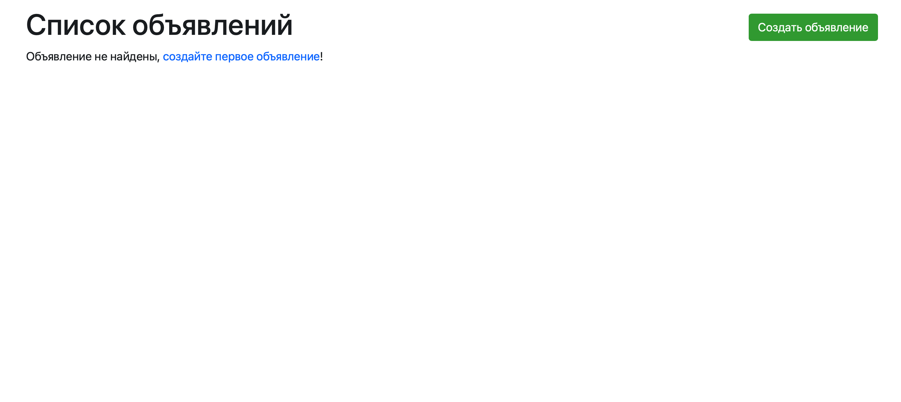
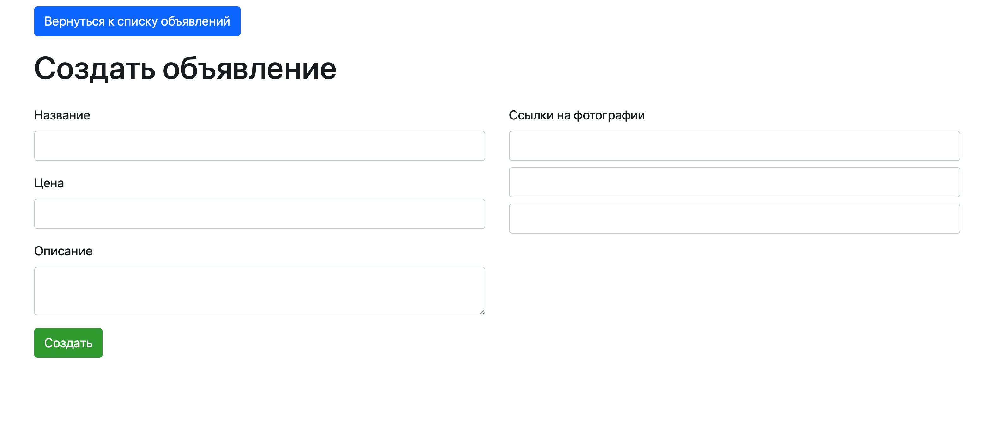
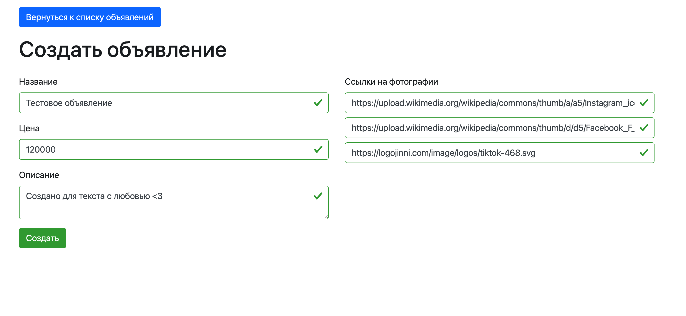
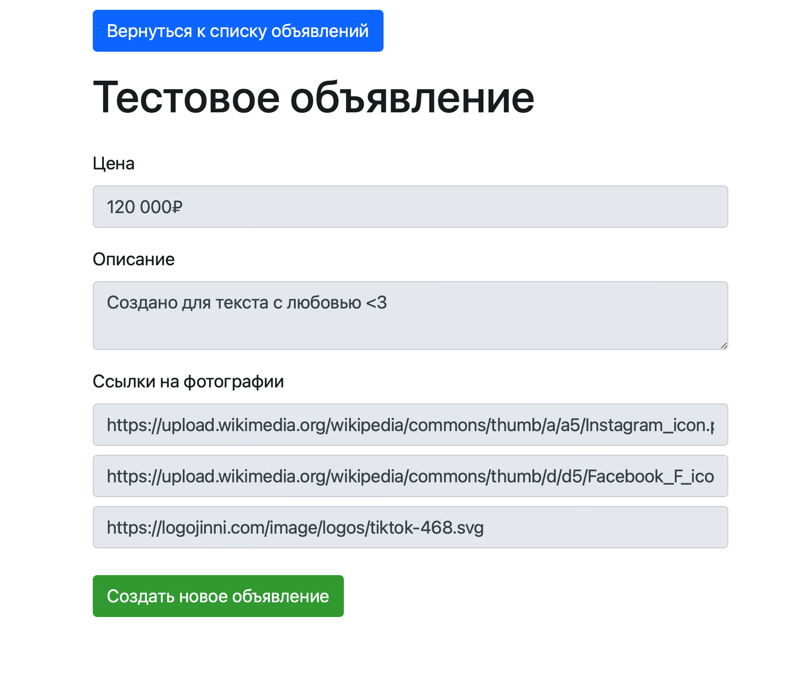
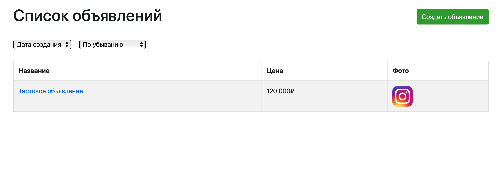

##  JSON API для сайта объявлений

1. Установить и запустить [Docker](https://hub.docker.com)  

2. Клонировать проект из репозитория командой `git clone https://github.com/Maxmarok/ad_test`, после перейти в директорию `ad_test`  

3. Выполнить команды из списка по порядку (если нет [Make](https://makefiletutorial.com), переходим к 3.1):  
  - `make init` - собираем образ, запускаем среду, устанавливаем пакеты, миграции  
  - `make npm_install` - компилируем фронтенд часть  
  - `make test` - протестировать бэкенд часть (опционально)  

3.1 Если у вас нет [Make](https://makefiletutorial.com), можно развернуть проект вручную через докер:  
  - `cp .env.example .env` (`copy .env.example .env` для Windows) - копируем данные для подключения  
  - `docker-compose build app` - собираем образ  
  - `docker-compose up -d` - запускаем среду  
  - `docker-compose exec app composer install` - устанавливаем пакеты  
  - `docker-compose exec app php artisan key:generate` - генерируем ключ  
  - `docker-compose exec app php artisan migrate:fresh` - перезапускаем миграции (убедитесь, что база пустая)  
  - `docker-compose exec app php artisan test` - прогоняем unit-тесты (опционально)  
  - `docker-compose run --rm npm install && docker-compose run --rm npm run prod` - компилируем фронтенд часть  

4. Открыть проект по ссылке в браузере `http://localhost:8000`  
  

5. На открытой странице щелкнуть ссылку или кнопку "Создать объявление", откроется страница создания  
  

6. Ввести нужные данные и нажать кнопку "Создать"  
  

7. Если все данные указаны верно, объявление создастся и произойдет редирект на его детальную страницу  
  

8. Также новое объявление появится в общем списке, который можно отсортировать по двум параметрам (дата создания/цена и возрастание/убывание)  
  

9. Также можно сидировать список объявлений (1000 штук), для этого нужно воспользоваться командой `make seed` или `docker-compose exec app php artisan migrate:fresh --seed`  

10. Как только проект наскучит, его можно выключить командой `make down` или `docker-compose down`  

### Получение данных через запросы к api  

POST `http://localhost:8000/api/v1/ads/list` - получение списка объявлений (пагинация 10 объектов)  
  • `page` - int  
  • `order` - `created_at` or `price`  
  • `sort` - `desc` or `asc`  

POST `http://localhost:8000/api/v1/ads/item` - получение конкретного объявления (по ID)  
  • `id` - int, required  
  • `fields` - bool `true` or `false`  

POST `http://localhost:8000/api/v1/ads/create` - создание объявления  
  • `title` - string, required, max 200  
  • `price` - int, required, max 1000000  
  • `description` - string, required, max 1000  
  • `photos` - array, required 1 item at least (max items 3)  
